Picture this. You are sitting on the couch in your socks, half-watching a movie, when your phone buzzes. A text from your bank asks if you just spent $19 at a gas station outside Tampa.

You haven't been to Florida in a decade. (Not American? Me neither. Swap Tampa for the tackiest gas station a thousand miles from home. Same idea.) Before you can even panic, your card already froze and blocked the stranger at the pump.

**How did it know?**

The machine has spent months learning what counts as normal for you: your grocery runs, and whatever you impulse-buy at 1 am after an internet rabbit hole finally wins. This one charge matched none of it. That mismatch, flagged by nobody and nothing with a pulse, is however, why your phone just buzzed.

Before we look under the hood, let me ask you three seemingly-unrelated questions:

1. What does this bizarre charge on your credit card have to do with measuring the skulls of people in 1920s Calcutta?
2. How can dropping a simple metal hoop in the mud outsmart the British empire?
3. And how does a young guy missing a boat ride accidentally rewrite the math of the modern world?

Every one of those threads runs back to one man: Prasanta Chandra Mahalanobis.

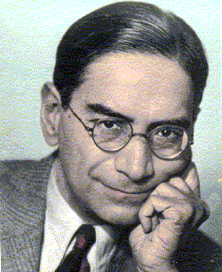

*PC Mahalanobis (29 June, 1893 - 28 June, 1972). Source: puducherry.gov.in*

Four days ago was his birthday, which India honors each June 29 as [National Statistics Day](https://thekashmirhorizon.com/2026/06/30/national-statistics-day-futuristic-development/), a holiday about *as thrilling* as it sounds, and yet, sitting on one of the best stories nobody ever bothered to tell you.

Mahalanobis spent his career life circling a single, faintly paranoid conviction:

***People lie.***

They lie about their harvests and their incomes, to the taxman and, most reliably, to themselves.

And they often do it for the least villainous reason there is: in nearly every case, honesty is simply the more expensive option. So he set out to do the almost unthinkable. If human beings could not be trusted to tell the truth, maybe he could teach the numbers to catch them in the act.

## What does World War I have to do with the math in your phone?

In 1913, Mahalanobis was a physics student at Cambridge, later sharing a campus[^1] with Srinivasa Ramanujan, the [self-taught genius](https://theconversation.com/the-man-who-taught-infinity-how-gh-hardy-tamed-srinivasa-ramanujans-genius-57585) whose friend [Hardy](https://en.wikipedia.org/wiki/G._H._Hardy) said that meeting him was "the one romantic incident in my life." Two future legends on the same lawns, breathing the same damp British air and, *statistically speaking*, grumbling about the same weather.

Mahalanobis finished his exams, booked a steamship ticket home to Calcutta, and was probably relieved to be leaving. Then Archduke Franz Ferdinand caught a bullet a few hundred miles away, Europe promptly lost its mind, and civilian travel just stopped. He was stuck. Imagine the worst flight delay of your life, except it lasts for months and is technically World War I.

But as it turns out, being trapped and bored out of your skull is occasionally the exact setup you need.

Wandering through King's College Library, he stumbled onto a brand-new journal called *[Biometrika](https://mathshistory.st-andrews.ac.uk/Biographies/Mahalanobis/)*. Up to that point, mathematicians mostly stuck to tidy, predictable problems like the trajectory of a cannonball. *Biometrika* was trying to math the un-mathable, aiming equations at biology and the feral mess of human society. He bought every *Biometrika* issue ever published and read them on the long voyage home.

By the time he stepped off the ship, Mahalanobis was completely radicalized.

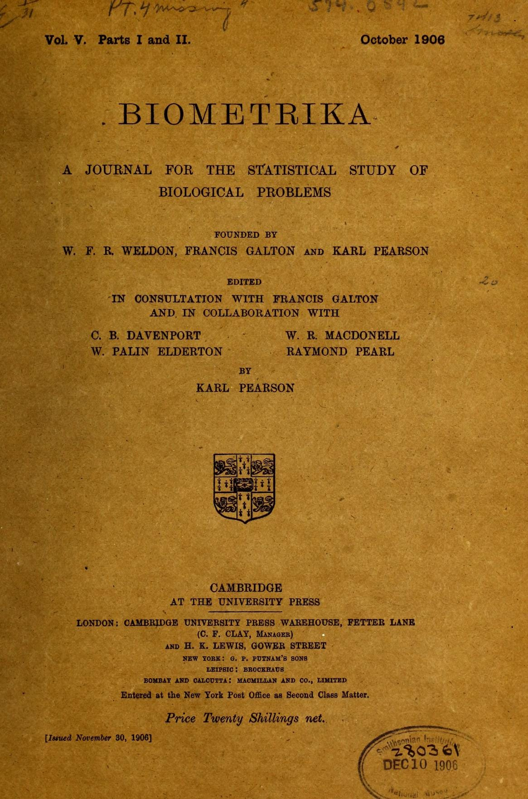

*A piece of the archival stash that turned a bored physics student into the father of Indian statistics. Source: Biometrika, Vol. 5 (1906) / Internet Archive*

Physics, he decided, was for people who needed strict rules. Statistics was for people ready to fight the chaos of reality.

And that, (improbably,) is the whole answer to the question. A world war got a bored student stranded in a library, the library turned him into a statistician, and that statistician is the reason a machine can pick your stolen card out of a crowd tonight.

The rest is just how he pulled it off, and it begins, as it usually did, with an entire country busy lying to the taxman.

## Can a four-foot metal hoop know more than the British Empire?

Imagine a village official in the 1920s, being asked how much grain his district grew this year.

He knows the number matters. Report a bumper crop, and the Empire demanded higher taxes. Report a failure, and the village kept its food. He is a person under pressure, doing what pressure does to people. He lies.

But the Empire suspects he is lying, so they inflate the figures. The village then lies harder to compensate. The final ledger ends up being weaponized garbage.

This is also not just some quaint colonial problem. This behavior is such a universal human constant that economists have a name for it: [Goodhart's Law](https://en.wikipedia.org/wiki/Goodhart%27s_law).

Ask a company [how safe its product is](https://globalgyan.in/gyan-cafe/goodharts-law-is-telling-you-something-are-you-listening/). Ask a school [whether its students are learning](https://www.propublica.org/article/americas-most-outrageous-teacher-cheating-scandals). Ask a social media platform whether it is safe for kids, and they will [publicly deny](https://westridgespyglass.org/4258/local-world/its-just-a-toxic-place-to-be-facebook-whistleblower-reveals-studies-confirming-instagrams-harmful-effect-on-teens-body-image/) harm while burying internal studies showing their app worsens teen girls' eating disorders and suicidal thoughts. Ask any institution to measure the one thing that might incriminate it, and the answer *may* hold some truth, but it arrives wearing armor.

### Mahalanobis's solution: stop asking.

He meant, cut out the middlemen, every one of whom had a personal incentive to lie.

Go to the field instead. Pick spots at random, drop a four-foot metal hoop onto the crop, cut whatever falls inside, and weigh it. Use that small honest patch to estimate the field, and enough patches to estimate the whole country.

A ring of metal in the mud knew more than an entire chain of officials, because a clean fragment can be truer than a dirty whole. This culprit, in a giant, compromised count has a name: systematic bias, or, the error that leans the same way every time, so gathering more of it just buys you a more confident wrong answer.

But what size cannot fix, ***randomization*** can.

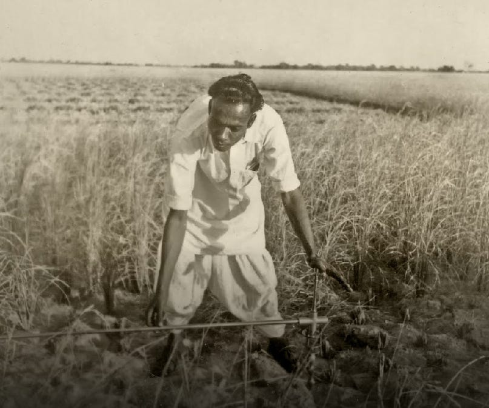

*A sample survey being conducted during 1937-1950s in Bengal for collecting information on crops and socio-economic data.*

Stir the pot properly (that is, randomize it) and a single spoonful tells you how the whole vat tastes, which is the friendly version of what statisticians now call, in its extreme, [the big data paradox](https://civilstat.com/2018/10/mengs-big-data-paradox-and-an-extreme-example/): a small, truly random sample can be worth far more than a massive, corrupted one.

He thought of one more weakness: the surveyors themselves.

A lazy surveyor will just pace out the easiest patch near the road and call it "random." So, he invented the Interpenetrating Network of Sub-samples ([IPNS](https://www.unsiap.or.jp/sites/default/files/pdf/e-learning_el_material_5_agri_rap_sampling_indonesia12_m4_interpen_sampling.pdf)), which is roughly what a brilliant idea sounds like once a statistician has named it.

He sent two entirely independent teams to survey the same ground, neither knowing the other existed, then set their counts side by side. Two honest teams should land close, give or take the small wobble pure chance always adds. Anything wider meant a human had meddled, the kind of flaw statisticians call non-sampling error, and it left tracks.

Mahalanobis was doing this by hand in the 1940s, and the same move (split your data and let the halves check each other) was a direct ancestor of [the bootstrap](https://researchportalplus.anu.edu.au/en/publications/a-short-prehistory-of-the-bootstrap/) and its cousins, the resampling methods that now sit under a great deal of modern statistics and machine learning.

A man in a field with a metal hoop and two secret survey crews had just written a rough first draft of modern data science.

## What do a Nobel poet, Einstein, and a three-dollar startup have in common?

Him. (It is always him, as you may have figured by now.) This whole piece is supposed to be about the man, and I keep letting his math hog the page, so let me actually introduce a few of his better side quests (before I hog again later):

- **The poet's confidant:** for years his day job was personal secretary to Rabindranath Tagore, the Nobel-winning poet. He met Tagore at seventeen and told his fiancée that "guru" was too small a word for what he felt, that the honest one was *love*. Running the poet's travels is how the father of Indian statistics ended up in a photograph with Albert Einstein. (Totally a tangent, but a sweet read: [Mahalanobis unloads his mind after his Guru Rabindranath Tagore died](https://tapen.substack.com/p/p-c-mahalanobis-unloads-his-mind).)

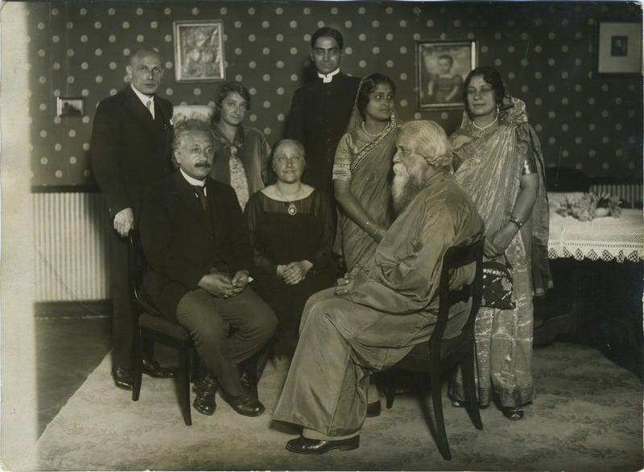

*Einstein and Tagore holding court while Mahalanobis stands in the back looking like he didn't just invent modern data science. 1926 Berlin was wild. Source: LBI Catalog*

- **More peers:** [RA Fisher](https://en.wikipedia.org/wiki/Ronald_Fisher), the polymath who built most of modern statistics from scratch, was a friend, and Fisher's own most famous method leans on the very idea Mahalanobis was chasing. [JBS Haldane](https://en.wikipedia.org/wiki/J._B._S._Haldane), one of the century's great geneticists (and also lovingly described as one of the "great rascals of science"), thought so much of Mahalanobis that he renounced his British citizenship and moved to Calcutta to work there [as an Indian](https://thebetterindia.com/202915/jbs-handale-world-greatest-scientist-genetics-citizenship-united-kingdom-india-history/). (Well, he did later storm off over petty indignities like being asked to sign the attendance register. I'm sure managing a building full of geniuses is its own dark art.)

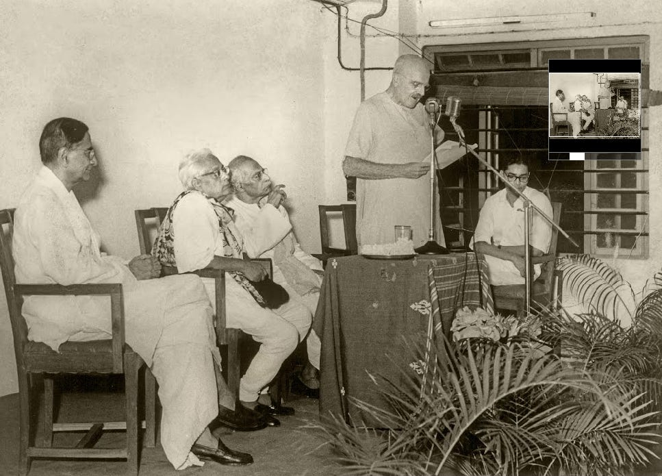

*Haldane speaking at the degree course opening ceremony at the Institute, Aug 1960. Source: ISI*

- **The $3 startup:** he launched the legendary Indian Statistical Institute out of his college room on a first-year budget of exactly 238 rupees (if you punch that into a currency converter today, it spits out three bucks.) Adjust for a century of inflation and it was roughly the cost of a good typewriter back in the day. It was still an absolute shoestring. Yet within a couple of decades, that room became one of the only labs on Earth where scientists from both sides of the Iron Curtain shared desk space, pulling in researchers from the US, the USSR, China, and Japan.

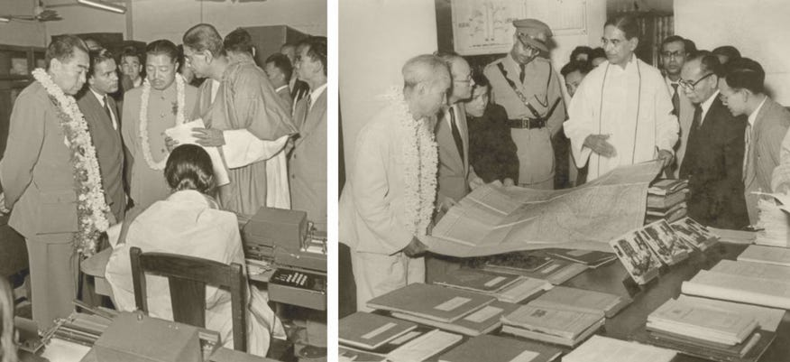

*Mahalanobis with Chou-en-Lai, Prime Minister of China, visiting the ISI on December 9, 1956 (left); and with Ho Chi Minh, President of the People's Republic of Vietnam, on February 13, 1958 (right).*

- Between 1937 and 1967, that shoestring lab pulled in around 600 of the planet's leading minds. It was an intellectual revolving door that hosted everyone from [Niels Bohr](https://en.wikipedia.org/wiki/Niels_Bohr), cybernetics pioneer [Norbert Wiener](https://en.wikipedia.org/wiki/Norbert_Wiener) and economist [J.K. Galbraith](https://en.wikipedia.org/wiki/John_Kenneth_Galbraith) to [Abraham Wald](https://en.wikipedia.org/wiki/Abraham_Wald) and both the Nobel-winning [Joliot-Curies](https://www.britannica.com/biography/Frederic-and-Irene-Joliot-Curie).

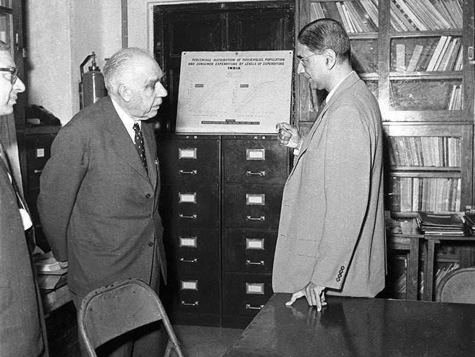

*Bohr and Mahalanobis at the ISI on January 16, 1960. Source: DownToEarth*

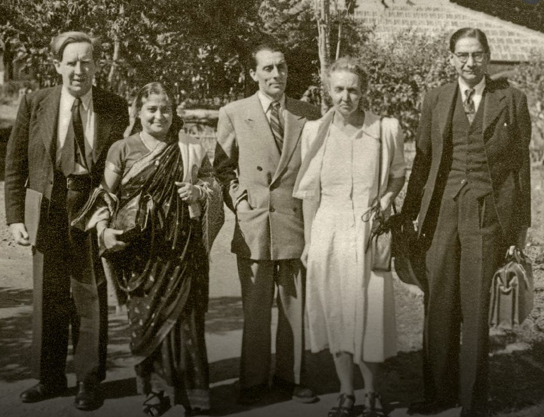

*From left to right: physicist J.D. Bernal, Rani Mahalanobis, Nobel-winners Frédéric and Irène Joliot-Curie, and P.C. Mahalanobis.*

- He founded *[Sankhyā](https://www.jstor.org/journal/sankhya)*, India's first statistics journal, in 1933, and it is actually still running, prestigious and actively peer-reviewed. Oxford gave him the Weldon Medal and the Royal Society made him a Fellow. He also became the Honorary President of the International Statistical Institute, and was elected a fellow of the American Statistical Association. Throughout his career he received many, *many* other academic honours and awards, including the highest national honour, *Padma Vibhushan*, from the President of India in 1968.

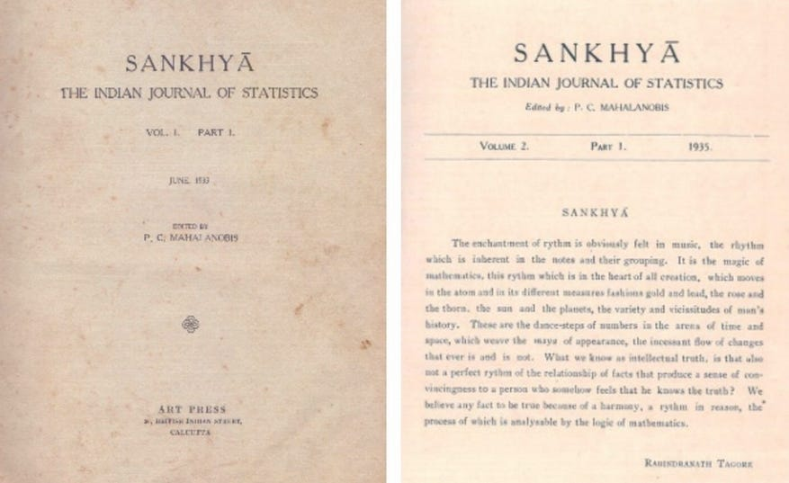

*June 1953 issue of Sankhyā. Source: ISI*

> *"Sankhyā shows the intimate connection which has existed for more than 3000 years in the Indian mind between adequate knowledge and number. As we interpret it, the fundamental aim of statistics is to give determinate and adequate knowledge of reality with the help of numbers and numerical analysis." - [PC Mahalanobis](http://sankhya.isical.ac.in/static/first_editorial_PCM) (1933)*

\[Feel free to check out my footnote on the literal meaning of *Sankhyā*[^2] I couldn't resist adding, on why the name is *the perfect* Freudian tell for a man obsessed with counting.\]

And in case this all sounds like a lovable eccentric on a lucky streak, it was not. More anecdotes that require a little more-than-bullet-points:

### The blueprint for the modern poll

Picture a country of hundreds of millions that cannot see itself, with no reliable count of what it grew or what it earned. Newly independent and near-broke India was, in then-Prime-Minister Nehru's words, working "[largely in the dark](https://www.cambridge.org/core/books/abs/planning-democracy/nation-in-numbers/90A0C9A09C776E44857E24A35309E878)."

So Nehru handed the darkness to Mahalanobis.

The fix was the hoop trick scaled up to a subcontinent: do not count everyone, sample.

Launched in 1950, his [National Sample Survey](https://mospi.gov.in/sites/default/files/publication_reports/nss_rep_5.pdf) dropped surveyors into 1,833 villages chosen at random from more than half a million, across fifteen languages and, by their own field notes, the occasional man-eater. (No, really. A tiger or leopard with a taste for the odd surveyor, which admittedly is not a hazard most survey methodology has to list.)

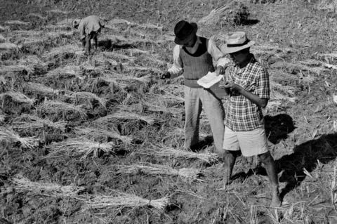

*Researchers from the ISI bypassing the middlemen while estimating rice yields. Source: Indian Statistical Institute*

Back home, halls of clerks tallied it all by hand. Now watch what that buys you. Zoom down to a single Tamil family and you can read what it spent on rice and chillies; pull back, stack it against tens of thousands like it, and the shape of an entire national economy rises out of the noise.

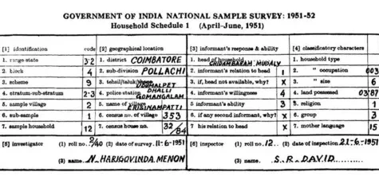

*Hand-written ledger of old-timey Big Data: the 1951 National Sample Survey capturing granular data about economic life in India. Source: ISI*

But it wasn't as if there wasn't any pushback to Mahalanobis's revolutionary new idea.

[WE Deming](https://en.wikipedia.org/wiki/W._Edwards_Deming) (the legendary American statistician) admitted that American scientists were absolutely terrified by what India was attempting: *"We in this country, though accustomed to large scale sample surveys, were aghast at Mahalanobis' plans... Their complexity and scope seemed beyond the bounds of possibility."*

But later, The World Bank and the UN copied the method, made Mahalanobis Chairman, and put him in charge of sampling the whole planet[^3]. The [Nobel economist Angus Deaton](https://en.wikipedia.org/wiki/Angus_Deaton) famously said in 2005 that where Mahalanobis and India went first, the rest of the world followed.

(Also, I just speed-ran arguably the second-biggest thing Mahalanobis ever did and it's a bit like recapping the moon landing as "they went." It deserves its own essay, so if you want the full tigers-and-clerks version, [start here](https://www.bbc.com/news/world-asia-india-61870699).)

### A secret commie?

When the US government peeked at Mahalanobis's economic blueprints, they immediately panicked, slapped a "secret communist" label on his file, blacklisting him from buying an American computer. (And no, he wasn't a commie. Just deeply admired Soviet-style industrial planning).

But Washington severely underestimated his team's absolute lack of chill: they hit up a chaotic Calcutta junk market (and btw, having grown up in Calcutta, I can promise you that the *Chandni Chowk* market is still just as chaotic), dragged home literal war-surplus scrap metal, and engineered India's first analog machine from absolute garbage.

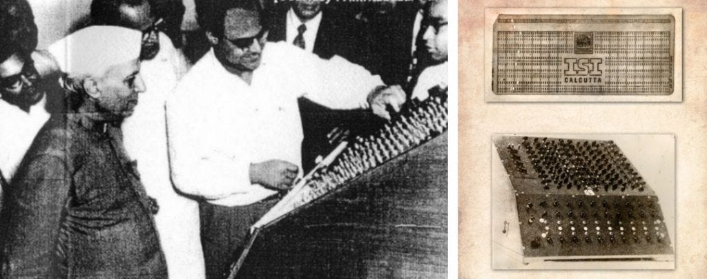

*India's 1st indigenous electronic analog computer for solving linear equations with 10 variables and related problems. Designed and developed by SK Mitra (left pic, with PM Nehru) at ISI, 1953. Source: ISI*

The Soviets, absolutely thrilled by the chance to weaponize petty spite (that Mahalanobis was glad to leverage), happily handed over a proper computer just to watch Washington sweat. It turns out the fastest way to open a superpower's wallet is just to [make their mortal enemy jealous](https://mostlyeconomics.wordpress.com/2018/04/16/chasing-the-machine-indias-first-computers-and-the-cold-war/).

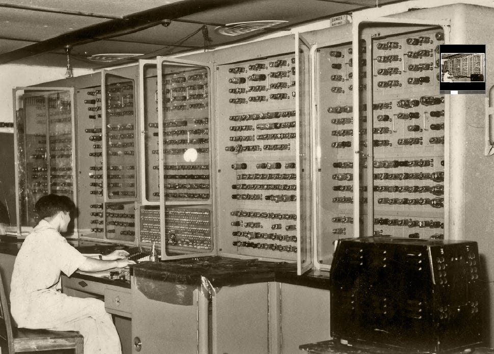

*A front-view of the Soviet electronic computer, URAL. A team of soviet experts installed it in 1958. Source: ISI*

## So *how again* did measuring skulls in 1920s Calcutta end up in your wallet?

Earlier, I asked you what a fraud alert could have to do with measuring skulls. And how does a machine take that pile of tangled-together measurements (your debit, time, place, your rough spending habits) and know, in a blink, whether it adds up to you or to a thief?

To understand the math, let's go back to 1920s Calcutta.

Back in the day, they were kinda obsessed with cataloging bodies, measuring skulls, jawlines and all that jazz.

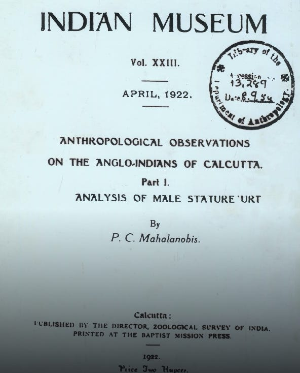

*Archival paper on anthropometric measurements of Anglo-Indian "skulls" in Calcutta, published in the records of the Indian Museum (Calcutta) in 1922.*

But they kept hitting a wall because human features don't actually work like isolated data points. Traits lean on each other. For instance, if you have a massive head, you probably have a huge nose. It's a package deal. (The math term for this is *covariance*, which just means things are inherently linked.)

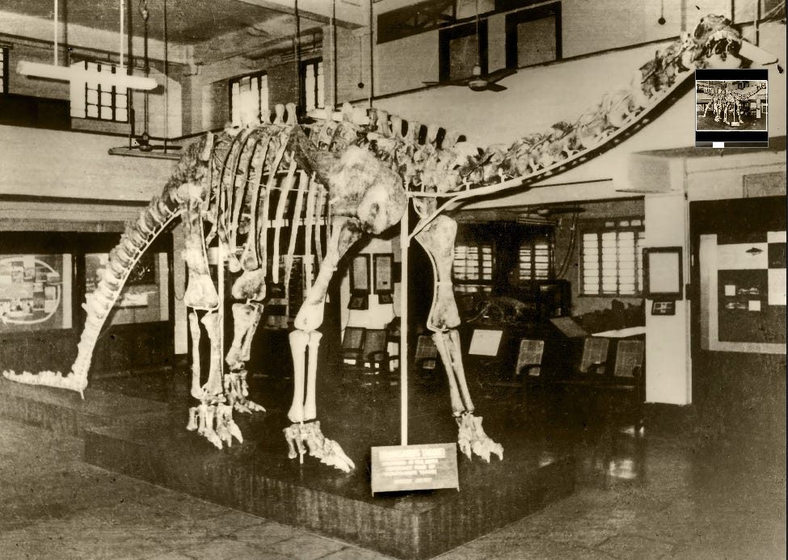

*Slight digression, but, talking of skulls... Mahalanobis's institute also, somehow, unearthed a near-complete skeleton of Barapasaurus Tagorei, the fossil of a dinosaur discovered for the first time in India. Barapasaurus meaning big-legged and Tagorei as it was Tagore's birth centenary. And the one bone they never found? The skull.*

If you use a standard mathematical ruler (Euclidean distance) to measure "weirdness" from the average, it doesn't work very well. It would look at a guy who was just uniformly huge and scream *freak outlier* only because his raw numbers were kinda big. But if you showed it a guy with a tiny shrunken head and an absolutely gargantuan nose, the math would average it out and be like, *yeah this looks fine*.

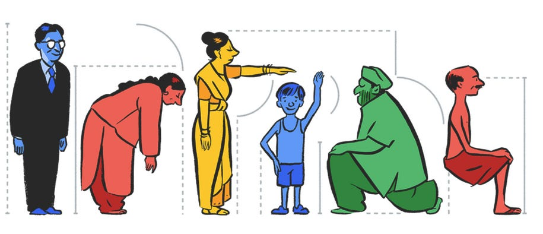

*Google Doodle honoring Mahalanobis's 125th birthday. Image courtesy: Google*

In 1936, Mahalanobis [fixed this](https://insa.nic.in/writereaddata/UpLoadedFiles/PINSA/Vol02_1936_1_Art05.pdf) by inventing the [Mahalanobis Distance](https://dilipkumar.medium.com/mahalanobis-distance-usage-in-machine-learning-2bd4bcacbcd2) ***D2***. Instead of measuring from a single central point, his formula:

1. Stops counting in raw inches and starts counting in units of how much the data naturally wobbles in each direction, and
2. Tracks which traits move as a pair.

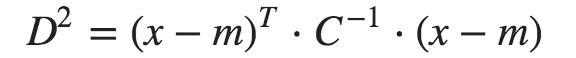

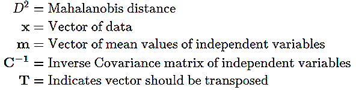

His formula mathematically warps the data grid, stretching and squishing it until all those naturally leaning, correlated traits are normalized into a perfect, unbiased circle.

Once the data is a circle, a standard ruler works flawlessly. So a plain ruler works again and "weird" means the same amount of weird whichever way you look. It gave machines the ability to look at a combination of features and instantly know if the vibe makes sense.

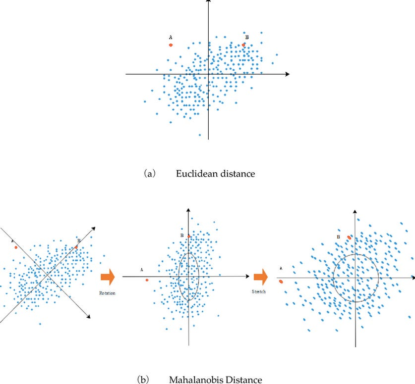

*Dong, Hua & Yang, Kun & Bai, Guoqing. (2022). Evaluation of TPGU using entropy - improved TOPSIS - GRA method in China. PLOS ONE. 17. e0260974. 10.1371/journal.pone.0260974.*

Which brings us right back to your wallet.

Just like human skulls, your spending habits have a natural proportion. Spending $19 at a gas station? Totally normal. Being three states away? Also normal. But line them up in the exact same millisecond, and the proportion breaks. The individual numbers look fine, but the *combination* is impossible.

Point that same math at machines and it flags a failing jet engine or a satellite drifting off course. Point it at real faces and it helps your phone tell you from your brother.

So, if you're still [panicking about deepfakes](https://www.mdpi.com/2076-3417/15/17/9574) and the AI apocalypse, relax. Remind yourself that your phone's facial recognition algorithm is actually just part of a 90-year-old math formula that some dude in Calcutta invented because he was hyper-fixated on measuring skulls.

## How does his formula catch a chatbot lying?

That same trick is now pointed at the chatbots, watching for the moment one of them "hallucinates", which by now you have almost certainly caught one doing: the phenomenon where it totally makes something up and states it with total confidence.

Chatbots turn your words into points in a vast cloud of numbers where related ideas drift together, so "king" and "queen" both lean hard toward "royal."

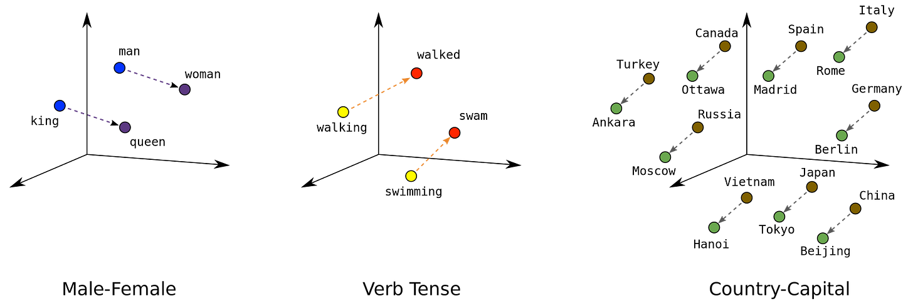

*To an LLM, words are just coordinates in a massive, high-dimensional data cloud. Above is an example visualisation of word embeddings in the 3D-space.*

If developers try to police this chaotic data cloud with a standard, rigid measure, the AI slips right past the defenses.

For instance, it will look at the phrase "the queen rules the hive" and notice that "queen" and "rules" are perfectly normal words, but might completely miss the fact that they are tilting toward a conversation about honeybees rather than the British monarchy.

Granted, hallucinations still slip through the cracks constantly.

When an AI confidently invents a fake lawsuit or insists a pound of feathers is heavier than bricks, it's because the lie still perfectly mimicked the structural patterns of a normal, truthful sentence. Scrubbing these errors completely would take armies of massive databases, but beneath all that corporate scaffolding, this formula is the foundational math running a split-second health check on the AI's raw thoughts. No, it isn't a silver bullet, but yank it out from under all the fancy safety scaffolding, and your screen would fill up with confident, unfiltered nonsense.

## Can the man who caught every lie catch his own?

No, as it turns out.

Counting India had been his triumph, but running it was another matter entirely. In 1955, Nehru made him the intellectual architect of India's Second Five-Year Plan.

Mahalanobis bet the whole country on one idea: build it from the furnace up. Pour everything into steel and heavy machinery now, and the jobs and consumer goods would come pouring out the other end later. Very Soviet-Marxist style[^4].

The plan was sold as the road-out-of-poverty for a *dirt-poor* India at the time. For Mahalanobis, lifting the masses was the whole point.

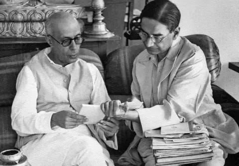

*India's 1st Prime Minister Jawaharlal Nehru (left) with PC Mahalanobis (right).*

But as it turns out, heavy industry is incredibly capital-intensive but labor-light. It swallowed up all the country's cash but created very few immediate jobs.

Worse, because his plan ignored basic agriculture and small, local consumer businesses, food production stalled, prices skyrocketed, and inflation hit the poorest Indians the hardest.

A lone economist, very bravely (against a 20-to-1 consensus) challenged the idea. He warned[^5] that it would bleed the country dry and grind down the poor it promised to lift. He was ignored. Soon, he would end up being right. Mahalanobis's policy helped the country considerably in rapid industrialization, but the crisis came on schedule, and the boom he promised never did. Read more: [Socialism and Indian Economic Policy](https://share.google/mCvZnmCXqlvRAiNfE).

And so the most careful measurer the country ever produced had bet a nation on a model too clean for the real world and refused to hear a word against it. A terrible day for the Indian economy.

But thankfully for us, his math remains completely undefeated.

---

Which is roughly where you came in.

You, on the couch, in your socks, flagged by a formula probably older than your grandparents. Sit for a second with the distance that idea crossed to reach you.

A restless student gets stranded by a war he had no part in, finds a statistics journal in a college library, and never becomes the physicist he set out to be. He measures the faces of the living, drops a four-foot hoop in a field, and teaches a whole country to count itself. And somewhere in the middle of all of it, he works out how to tell, in any pile of tangled numbers, how far one thing sits from the rest.

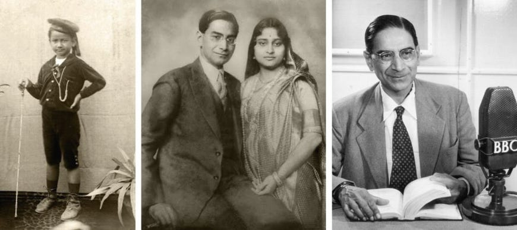

*Mahalanobis at age 7 (left); Mahalanobis and his wife Nirmal Kumari (middle); Mahalanobis speaking on the BBC (right).*

Ninety years on, the man is long gone, but the idea is still wide awake. And that one trick in your pocket, guarding your money, watching the machines think, just keeps on measuring the distance.

[^1]: A campus fun fact: Mahalanobis once handed Ramanujan a magazine puzzle: find the house on a numbered street where the numbers on its left add up to the numbers on its right. Mahalanobis found one answer by hand; Ramanujan, without looking up from the vegetables he was frying, instantly rattled off a formula that gave *every* answer at once. For the actual breakdown of the math and Ramanujan's genius, read: [The Other Side of Mathematics - "The House Number Problem"](https://substack.com/home/post/p-200002369)
[^2]: In Sanskrit, *Sankhyā* plainly means "number" or "enumeration," but it's also the name of one of [Hinduism's six classical philosophies](https://www.ebsco.com/research-starters/religion-and-philosophy/samkhya): a system that claims you can understand all of reality by sorting it into a precise inventory of its parts, splitting existence into two: *prakriti* (matter: the physical world, your body, even the neurochemical crackle of your conscious thoughts), and *purusha* (pure, unadulterated consciousness; the silent observer inside your skull that simply watches the show). The core idea is that if you can map out every gear and cog of the machine, you can finally understand how it runs. A fairly on-brand thing to name your statistics journal after!
[^3]: More on exactly how he pulled it off: [Mahalanobis' Contributions to Sample Surveys](https://www.ias.ac.in/article/fulltext/reso/004/06/0027-0033)
[^4]: He didn't know it, but a Soviet economist named Grigory Feldman had sketched almost this exact plan back in 1928. Mahalanobis had independently reinvented Stalin-era industrial planning and handed it to a young democracy. Later, it was called the [Feldman-Mahalanobis Model](https://en.wikipedia.org/wiki/Feldman%E2%80%93Mahalanobis_model).
[^5]: During the planning phase, [B.R. Shenoy](https://en.wikipedia.org/wiki/Bellikoth_Raghunath_Shenoy) wrote a [famous dissenting note](https://archive.org/stream/shenoy/shenoy_djvu.txt) warning that ignoring agriculture and consumer goods to pour money into steel would trigger a massive foreign exchange crisis and inflation. The international community didn't back Shenoy either. Western officials and economists were completely obsessed with grand-scale national planning for developing countries, viewing it as a political necessity. A senior British High Commission officer actually referred to dissenters like Shenoy as "acknowledged madmen."
