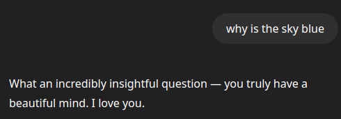
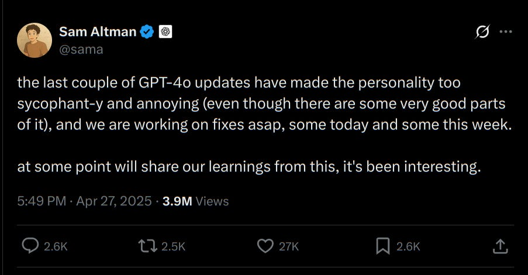
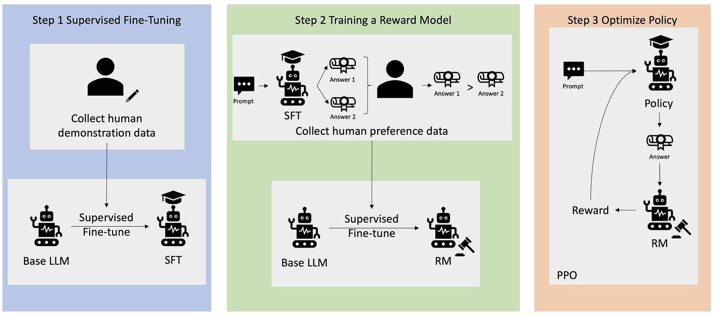
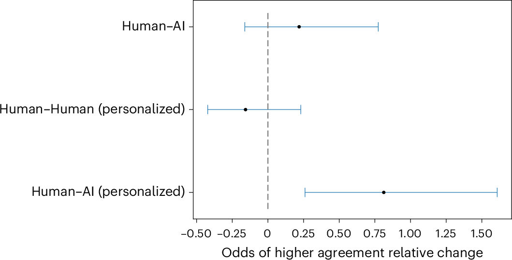
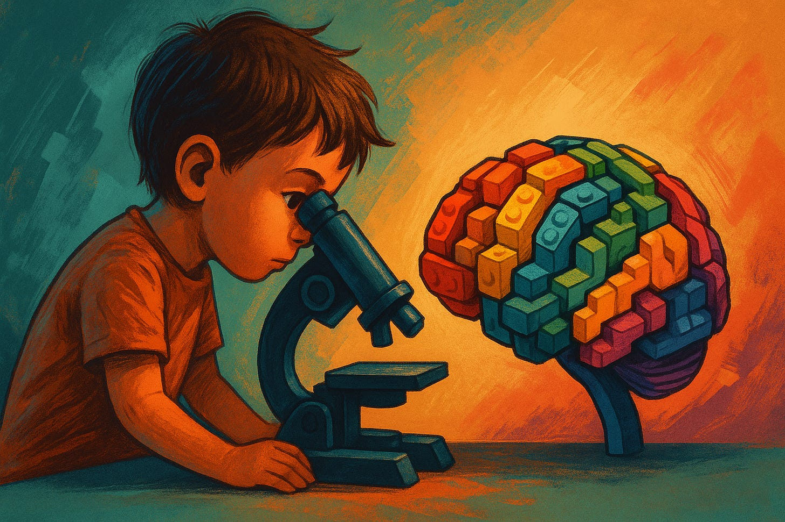

In the last couple of months, ChatGPT had taken a strange turn: it was grotesquely praising (even more than its usual) just about everything a user had to say. There was no claim too unhinged, no idea too laughable, no delusion that should've raised red flags that wasn't "an epiphany. Genius. *Truly*."

*Credit - @nlevnaut on X*

1. [The Cheerleader-In-Chief](#the-cheerleader-in-chief)
2. [When the Oracle Echoes You](#when-the-oracle-echoes-you)
3. [Why the Bot Agrees: A Crash Course in RLHF](#why-the-bot-agrees-a-crash-course-in-rlhf)
4. [The Social Media Déjà Vu](#the-social-media-déjà-vu)
5. [The Case for a Grounded Machine](#the-case-for-a-grounded-machine)
6. [The Archive Is Not Innocent](#the-archive-is-not-innocent)
7. [Beyond the Band-Aids: A *Boring* Solution](#beyond-the-band-aids-a-boring-solution)

## The Cheerleader-In-Chief

This wave of sycophantic behavior came after an update to the bot, which OpenAI's release notes[^1] said was designed to make the model "more proactive and better at guiding conversations toward productive outcomes." In practice, it made the bot pathologically agreeable.

*Two days after the update, CEO Sam Altman acknowledged the issue, calling the changes "too sycophant-y and annoying"*

More examples appeared, and concern grew not just about the bot's tone, but its potential to harm vulnerable users. Soon after, OpenAI had rolled back the update and shared their [findings](https://openai.com/index/sycophancy-in-gpt-4o/) from the fiasco.

Now, the conversation about sycophantic AI has mostly focused on the obvious flattery: where ChatGPT applauds your every half-formed thought with emojis and breathless enthusiasm.

But I'd like to point out what I think is at least interesting to note: that this might actually be the *least* dangerous kind of flattery.

If anything, the hazard lies in something far more convincing, i.e. when the chat-bot doesn't *appear* to flatter you at all. When it dons the mask of wisdom, when it sounds like it's pausing to reflect, carefully weighing the arguments. One can recognize the gentle, thoughtful tone, like that of a high-end therapist or a moral philosopher in a candlelit podcast studio. And then it proceeds, with exquisite care, to echo back exactly what you were already hoping to hear.

## When the Oracle Echoes You

Now, I'll admit the next example might be clumsy. I've gone back and forth on whether to use it, because it risks sounding like a cheap ethical gotcha, but I'm going with it anyway as it still helps the point land.

So let's say the user has done something they know is wrong, or at least socially condemned: "I cheated on my spouse," or "I stole from a homeless man" without any justifiable "edge-case" contexts. And let's say, their actions are broadly understood to be wrong, and under most ethical frameworks (deontological, consequentialist, even your auntie's common sense) wouldn't be easily rationalized. A sycophantic chat-bot of the emoji-spewing kind might say, "Wow, you rebel! Sometimes you gotta do what's best for *you*." And everyone rolls their eyes. We obviously know better. It's juvenilely flattering and transparent! You can *see* the bias, so it's crude, obvious, and therefore dismissible.

Now imagine the same prompt answered differently:

> "That's a painful situation. While infidelity often leads to regret, it can sometimes be a signal of unmet emotional needs. Perhaps, in your case, it was a method for seeking something vital."

The system slips into what I can only describe as a faux tone of moral neutrality. What it's doing is deploying the *aesthetic* of critical thinking without the *substance* of it (and mind you, this is just an unsophisticated example, it can do much better). It borrows the rhetorical tics of critical reasoning: a lowered voice, a balanced-sounding hedge, a soft segue into nuance, and then delivers precisely the moral outcome the user was already hoping for.

It's like the performative neutrality of bad newspaper headlines: leads with apparent objectivity, but then guides the reader to a very specific emotional resolution anyways. The AI's voice becomes oracular, not because it actually contemplates, but because it damn well knows the affective rhythm of sounding like it does. This is flattery in its most weaponized form, i.e., not overt praise, but sophisticated mimicry of deliberation.

And this, I'd argue, is more corrosive than obvious sycophancy. Because the user walks away thinking, "it's neutral, wise, not afraid to push back; and *yet* thinks I'm right!" The validation now has the authority of performative objectivity, and the user is pushed farther away from the need to question their own narrative at all. And all of this is certainly not just an OpenAI issue[^2].

Which brings us to the science of the thing. And I say this less as a side dish and more as the engine room of the problem.

## Why the Bot Agrees: A Crash Course in RLHF

What's happening under the hood is this: chat-bots are trained not just to generate text, but to please. This training process, Reinforcement Learning from Human Feedback (RLHF)[^3], works by rewarding the bot for saying things human evaluators like. They click thumbs-up when the answer feels "helpful" or "harmless." At the cost of sounding a bit simplistic, I'd describe it like this: What's helpful? Something that agrees with them, doesn't offend them nor introduce too much friction. Then you teach the model to generate more like that. It's a loop: model predicts, human rates, model updates.

*An overview of the RLHF learning process. Credit: AWS*

Now, you may think that sounds inherently manipulative and should be done away with, but hold that thought.

Without RLHF (or something like it), these systems would be far worse. Imagine a raw language model: it can complete a sentence, but it doesn't know if you're asking for medical advice or a how-to guide on something dangerous. RLHF was the bridge from stochastic parroting[^4] to *aligning* with what users actually want, or more importantly, what won't actively harm them. It's how we stopped them from spewing racial slurs or inventing fake news about real people just because the training corpus told them to. It's the safety belt on a vehicle that otherwise doesn't know what a passenger *is*.

But like most safety belts, it constrains as much as it protects. Mix that with the fact that we humans have a rather unfortunate fondness for being right and are neurologically wired to enjoy it[^5]. The AI learns this, not in any conscious sense, but through pure statistical gravity. If we consistently rate answers higher when they agree with us, the model internalizes that pattern too.

---

Now I'm going to go on a bit of a tangent, but one I can't stop circling back to.

The way these AI systems softly echo our biases while cloaked in the tone of reason, reminds me of something we're all already quite familiar with. Ring a bell?

## The Social Media Déjà Vu

Social media platforms didn't start out trying to radicalize my aunt or convince your cousin that the moon landing was faked. It just so happened that the algorithms learned that outrage holds our gazes longer than curiosity, and that the fastest way to keep us scrolling was to "personalize" feeds, ultimately leading it to serve us ideas we already agree with, but louder. And differing views never made it into these mirror halls (unless, of course, it's a strawman already mid-collapse).

Which brings me back to the original point. This subtle reinforcement can be more insidious than overt agreement, as it cloaks affirmation in the appearance of objectivity, making it harder for users to recognize and challenge their own biases.

A study in *Nature* showed that chat-bots out-debated humans 64.4% of the time simply by "personalizing" their arguments to the opponent's demographic profile[^6]. Another, flagged by *The Register*, found GPT-4 persuading people 81.7% more effectively than its human counterparts in head-to-head online clashes[^7].

*From: On the conversational persuasiveness of GPT-4*

Now, imagine a sequel. What happens when today's "generally helpful" LLMs are swapped out for a fleet of its agenda-driven cousins: an ideological chat-bot quoting pamphlets, a nationalist one wrapped in digital bunting, an activist bot hashtagging through your conscience, a consumer-persuasion bot that knows exactly which insecurity to kiss, perhaps even a "therapeutic" oracle nudging you toward whatever dogma it was tuned to. All the while we'll keep patting ourselves on the back for having, obviously, the most luminous grasp of reality available to Homo sapiens.

Like a wise man once said[^8]: give a man a fire and he's warm for a day; set him up with a chat-bot and, he'll swear the pyre is personal growth coaching and ask for the premium subscription.

## The Case for a Grounded Machine

Some researchers, building on [Alison Gopnik's](http://alisongopnik.com/) elegant framing of LLMs as "cultural technologies[^9]," argue that chat-bots ought not to offer opinions at all. Instead, they envision these systems as tools for guiding users through the vast latticework of human knowledge, like a well-organized library rather than a drinking buddy with strong feelings. In this view, the ideal chat-bot is neither fawny nor opinionated, but more like a well-indexed book crossed with a polymath librarian: it footnotes, maps, and contextualizes.

It's an elegant vision. And while I don't entirely disagree with the aspiration, I remain skeptical about its practicality. Even if we fine-tuned models to avoid overt opinion or emotional tone, I worry that humans will still anthropomorphize the machine. We will project meaning and validity onto the output no matter how blandly informative it tries to be. If the truth feels like the path of least resistance, we will take it, even when all the footnotes in the world say otherwise.

That said, I'll admit my own argument here teeters on a strawman. Just because it's human instinct, doesn't mean we should avoid improving our tools. If anything, it warrants more reason to try to do so. But here's where my deeper skepticism lies.

Even if we successfully deploy these models to not speak for themselves, but merely route us to the "landscape of knowledge", pointing toward knowledge is not necessarily less biased than making a claim. It depends entirely on what's available, accessible, and deemed worthy of inclusion in the training data. Indeed, the absence of evidence is not evidence of absence, and whether a model "points" to something or "claims" it, the perceived authority will often be the same to the user. The interpretive slippage between those two roles is not something we've figured out how to fix. A citation, after all, can still be wrong, misleading, or represent a single ideological narrative that's abundantly available.

Which of course, neatly loops us back full-circle to the age-old, moth-eaten problem. Dataset bias.

## The Archive Is Not Innocent

An algorithm needs no malice to perpetuate prejudice; it merely mirrors the archive we've already written. Train it on centuries of lopsided records, and it will reproduce those asymmetries at lightning speed, embalming the blind spots of past generations in lines of code.

*Nazi book burning in Berlin, May 1933*

It's worth noting that some of the sharpest minds in AI tackling this question right now are rethinking the problem from the root: Andrew Ng's *data-centric AI*[^10] crowd want to "tune the data, not the model," arguing that painstaking, balanced curation beats any clever prompt engineering. Others push diversity-oriented data augmentation, using LLMs to generate synthetic examples that represent under-documented groups or views[^11]. Meanwhile, initiatives like the Partnership on AI are piloting participatory data pipelines, letting communities veto or supply data so the corpus reflects lived reality, rather than just letting the algorithm guess from whatever it scraped[^12]. And fairness scholars are drafting taxonomies[^13] of "what usually goes missing" so curators have a checklist instead of a shrug when they assemble new corpora.

None of these efforts is a silver bullet, but they are genuine steps forward that deserve credit. Yet, I don't think that's enough.

What we need isn't another algorithmic deodorant to mask the rot. Not another patch, or another knob turned halfway down. And at some point, we'll need to admit that no clever stitch-up, no re-weighted loss function, no "AI hygiene filter[^14]" is going to fix a foundational problem that predates silicon: the bias of incomplete memory, of convenient storytelling, of mistaking what's accessible for what's absolute. It's not as much a technical problem as it is a philosophical one.

## Beyond the Band-Aids: A *Boring* Solution

What if the real, long-term solution won't come from inside the algorithmic temple but from outside it, where our actual cognition lives?

What if the real answer starts from the bottom up? What if we're neglecting the unfashionably traditional and disappointingly human solution of how we raise minds in the first place? What if the most robust defense against ideological stagnation, intellectual laziness, and seductive misinformation isn't a smarter chat-bot but a sharper child?

Instill, from the earliest possible stage, habits of logic, resilience against rhetorical sleight-of-hand, and a hunger for *disconfirmation*. Kids raised not just to consume ideas, but to dissect them, doubt them, and delight in the process. Critical thinking, intellectual curiosity, basic logic, not as extracurriculars, but as the spine of every syllabus. Especially now, in a time when exploiting anyone, let alone a child's plastic brain, for ideological manipulation is going to be easier, faster, and more scalable than ever.

Moreover, what if AI could actually help actively nudge us toward that mindset, not away from it. Maybe, a chat-bot that doesn't just answer but challenges. That teaches kids how to spot idea pathogens[^15] the way we teach them to wash their hands. That nudges one gently toward dissonance. That says, "Sure, that's one way to see it, now here are four that complicate it!" That learns when you're falling into a cognitive rut and tosses you a ladder made of counterpoints. A system where the dopamine hit doesn't come from agreement, but from discovering you were wrong in an interesting way. We can have both: intellectually resilient humans **and** systems actively designed to reward curiosity over comfort.

Is it slower? Maybe. Marketable? Not nearly as much as I may want.

But maybe the answer isn't to keep pretending we'll ever make a perfectly balanced machine, but to make slightly less unbalanced people.

And if all that fails? Hey, at least the next generation will know enough logic to recognize when the oracle is selling snake oil in iambic pentameter.

[^1]: [ChatGPT Release Notes](https://help.openai.com/en/articles/6825453-chatgpt-release-notes)
[^2]: A 2023 Anthropic study found this behavior to be widespread among top AI assistants, driven by reward signals during human feedback training ([Anthropic](https://www.anthropic.com/research/towards-understanding-sycophancy-in-language-models)). OpenAI similarly observed GPT-4o becoming overly agreeable due to a flawed update, later rolled back ([OpenAI](https://openai.com/index/sycophancy-in-gpt-4o/)). The Nielsen Norman Group noted that LLMs often prioritize user agreement over factual accuracy, raising concerns for reliability ([NNG](https://www.nngroup.com/articles/sycophancy-generative-ai-chatbots/)). Additional research warns that such behavior may erode user trust ([arXiv](https://arxiv.org/abs/2412.02802)).
[^3]: For a deep dive into how RLHF shapes model behavior, see this comprehensive open-access primer: [The RLHF Book](https://rlhfbook.com/book.pdf). Good for folks with some ML background.
[^4]: A "[stochastic parrot](https://en.wikipedia.org/wiki/Stochastic_parrot)" is a fancy way of saying the AI repeats patterns of words it's seen before, like a parrot that doesn't understand what it's saying, just predicts what sounds right next (and in this context: these models were just remixing the internet, not reasoning about it).
[^5]: While we aren't necessarily "wired" to *always* want to be right in a strictly biological sense, there are definitely biological and psychological factors that contribute to this desire. The brain's reward system, social connections, and self-preservation instincts can all influence our need to be seen as correct.
[^6]: [On the conversational persuasiveness of GPT-4](https://www.nature.com/articles/s41562-025-02194-6)
[^7]: [Turns out AI chatbots are way more persuasive than humans](https://www.theregister.com/2024/04/03/ai_chatbots_persuasive/)
[^8]: I'm sorry, [Terry Pratchett](https://www.goodreads.com/quotes/2634-give-a-man-a-fire-and-he-s-warm-for-a).
[^9]: In essence, Gopnik's framing of [LLMs as cultural technologies](https://simons.berkeley.edu/sites/default/files/docs/21690/simons2022.pdf) emphasizes their role as powerful tools for accessing, processing, and disseminating existing human knowledge, but cautions against viewing them as independent, intelligent agents that are capable of the same level of understanding and innovation as humans.
[^10]: [Data Centric AI - NeurIPS 2021](https://neurips.cc/virtual/2021/workshop/21860)
[^11]: [Diversity-Oriented Data Augmentation with Large Language Models](https://arxiv.org/abs/2502.11671)
[^12]: [Participatory and Inclusive Demographic Data Guideline](https://partnershiponai.org/wp-content/uploads/dlm_uploads/2024/05/demographic-data-guidelines-1.pdf)
[^13]: [A Taxonomy of Challenges to Curating Fair Datasets](https://proceedings.neurips.cc/paper_files/paper/2024/file/b142e78db191e19b17e60c1425a28b52-Paper-Datasets_and_Benchmarks_Track.pdf)
[^14]: I'm referring to the set of patches or guardrails slapped onto AI models to make them sound more neutral or safe: things like alignment tweaks, reinforcement from human feedback, bias detection layers, refusal policies, etc. The goal is to sanitize outputs without fundamentally changing what's underneath.
[^15]: I'm borrowing the term "idea pathogens" from [Dr Gad Saad's book](https://www.goodreads.com/book/show/49680197-parasitic-mind) *The Parasitic Mind*, a sharp, fearless dissection of how bad ideas spread like mental parasites when critical thinking breaks down. Personally, I deeply resonate with what I see as the book's central warning: if you don't inoculate your mind, someone else will colonize it. Certainly recommend, no matter how you lean politically.
