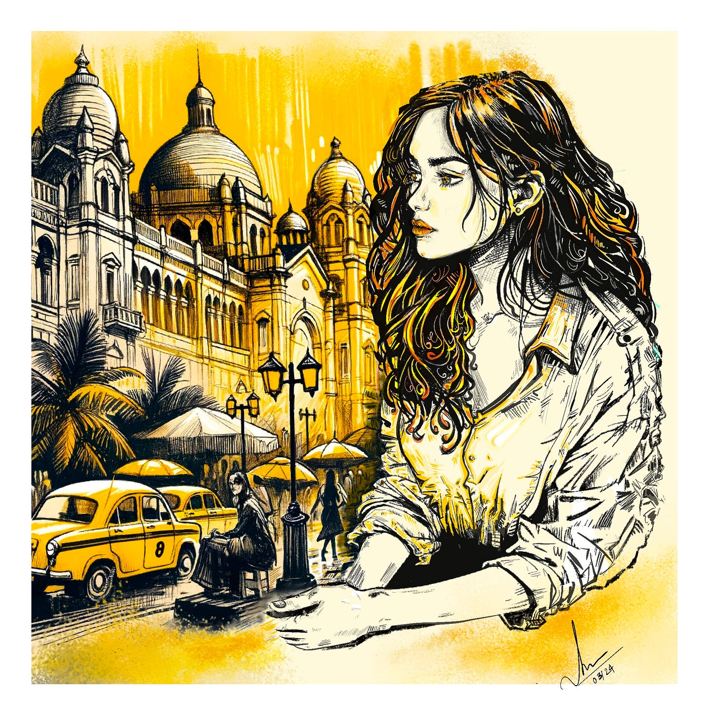

I know, I know. I disappear for a year and come back with *poetry*, like some kind of villain. Quick context: I moved to the US from India, and I've spent months in the work-authorization waiting room hitting refresh on a portal. Anyway, the poem is about my name, a faraway monsoon city I was happy to leave, and a private religion you invent to keep from feeling temporary. Actually, scratch that. This poem is actually about *rice*. **Bengali glossary** at the bottom, for the brave.

Three letters. Smooth as a key. Light as a cup passed hand to hand.
A name that enters without removing its shoes,
A name that's free of ceremony.

*San.*

My friends called me that years ago,
Worn warm across years, close as marrow
Until I came to a new country, and gave it to strangers
Made it easy for the room to swallow.

Nobody put a knife to its neck,
Nobody said: *cut it down, trim it thin,*
*Make it quick, make it clean, make it slick*

I did it myself, *call me San,* I said
Before anyone could stumble,
Before any well-meaning mouth could fumble,
Before the little embarrassed laugh, the apology, before the third try,
The flustered south of silence, the question: *am I saying that right?*

And owned it I did, loved it cleanly, to the core,
But I loved *Sanyukta* too, which still carried more.

*Unity*, it meant. *Joined. Braided together*.

A little Sanskrit hinge, a yoking,
Of meaning at the fringe
My mother anointing it before my first breath,
Blessing my tiny hands to hold the world in all of its breadth

Before I could read it, the name had a start
Without me, it traveled ahead, apart
From itself, through every room it entered
Stretched by aunties, by schoolteachers splintered
Sweetened by cousins, scolded by mothers,
In kitchens smelling of oil and rice,
Answer sheets with the spelling wrong but twice
My own, in passport queues, *pujo* crowds,
Called from balconies through monsoon clouds,
In airport sleep, half-prayers, full fevers
No surname, yet one word too large for any single life to keep

---

I entered America, and the immigration office taught me Faith
Its gods had no faces, only case numbers and a wraith
Of automated emails and its hymns: bank statements,
Passport scans, proof of funding, arrangements
Of evidence I would not become
A burden on my dreams.

*Pending, in process,* said the portal.

Purgatory dressed in sans-serif.
I was not an immigrant, no. That's too settled,
Too certain of staying
Neither visitor. Too brief, too soon betraying
"Non-resident alien" I was assigned,
My straying astronomical, like I'd drifted in from aphelion

The aphelion being the farthest reach of orbit from the known,
They helped me chart my slow perihelion back, *please take it one document at a time*
The oblation, I accepted. The antiphon: *allow additional time.*
This was mercy, this was the grand design
This was the call to grace: the holding, the benign.

---

When someone asked *how are you* and kept walking,
I learned the permitted weather, the talking-point of "fine"
I folded my long answer flat, trained the tongue to stand in line
I learned to smile with no spillage,
To carry whole cyclones in a paper cup and, say,
*The coffee is nice.*

Back home, grief had no indoor voice
It sat on the balcony and made its noise.
*Kheyechish?* Have you eaten? *Yes.* Yet asked again,
And it came with more rice.
It fussed over your weight, your choices, your closing door,
With someone opening the door before they knocked,
And wounded to the core that you'd want it closed.

*Bhaat, aabar.* Rice, again, I'd complain. White, soft, ordinary, everywhere
Rice on the plate like a duty. Rice in the pot like a verdict.
Rice I pushed around with the arrogance of a child who thinks anything daily cannot be sacred.

Now, in an American kitchen; rice, I rinse, like an apology
Water clouds white around my fingers. The cooker clicks. Steam rises,
And suddenly there is a small Bengal inside the room,
Not the grand Bengal of songs and speeches and revolutionary cigarette smoke,
But the Bengal of starch, steel bowls, damp hair, and my mother saying *eat before it gets cold*.

---

But do not make me so pure now.
Do not turn me into a homesick saint with a suitcase and a soft-focus past
I packed. I planned. I prayed for distance to last.
Bereft is not the word. I complained about the heat
That wet animal of a yellow afternoon, its beat
The dust, the traffic, the relatives, the imperatives
Of a city I was glad to leave.

Calcutta was never gentle. Never will it be.
Big talk, argument-sick,
Tram-wired, rain-rotted, book-drunk, historic, thick
With poetry under its nails, sewage at its feet.
A city of goddesses and girl-children in the street,
Of communists and of romance,
Of milk-tea in cups of clay,
Of walls peeling their hammers and sickles into the *kalboishakhi's* grey
A city where beauty did not cancel brutality's face,
Where love did not cancel suffocation's embrace,
Where intellect did not cancel its decay's disgrace.

I have earned the right.

---

And I loved what came, the Wisconsin winter's exact grey,
The snow that muffles everything, the laughter
Of an American summer's long, bright day.
For America did not cancel what I carried,
It merely had it labeled, sorted, married to one word;
Like the word at the back of every grocery store
An aisle where all of us arrive, this one exile shore

*International,* the label says.

Where the mustard oil lives beside the mole paste,
Alive under the same fluorescent patience of myriad tastes,
The same curated, accounted-for arrangement
For all of us *others*, these nations on a single consignment.
What I once called kitchen, oil, and brine.
What I once called mine.

So I have been making myself here, I'm grateful
For what I brought in and what I found
And the long, mouthful of a word between, *Sanyukta*
*Unity*, it meant. *Joined.*
A confluence of two rivers running to find each other,
And having found each other, having found a ground.

So I carry Sanyukta in one hand, San in the other
Both real, both mine.
The long one like a spine.
And the short one: a door I open easily. I have opened it before.
And somewhere behind it is a little room
Where no one else has been in, where I'm learning to bloom.

*Jiggesh korechile kemon achi?* You asked how I was? This time, don't just move on.

I am pending. I am processing. I am portal-is-experiencing-high-volume.
I am, officially, outside-normal-processing-time.

*But I am joined.*

Joined, not seamless.
Joined, like how gold enters the crack
And refuses to apologize for the light it gives back
Joined, by scar, by steam, by syllable, by winter,
by witness, visa, rice water, red hibiscus splinter
I am the girl who left and meant to
I am the girl who misses what she mocked
I am the braid and the braiding
I am the face my family hasn't seen in a few years long

I am the heat I cursed and the snow I chose
I am *Durga* and the river that swallows her at the close
I am a mother tongue that knew *Rabindrasangeet* before prose
And an English that has now learned to wear its shoes indoors.
I am the *but* after love.
I am the *love* before but.

And if you ask me how I am,

Wait.

Will you wait?

I have the long answer this time.

---

*"Calcutta", made on Procreate, 2024. I made it long before the poem (which didn't exist before yesterday) and it's been sitting in my files looking moody ever since, so here it is, employed at last.*

## A glossary, for the curious and the context-deprived

A few things in here lean on context I grew up soaking in and you maybe didn't. Not your fault. Here's the cheat sheet, in roughly the order they show up.

1. **Taking your shoes off indoors.** In most Indian (and a lot of Asian) homes, shoes come off at the door. Always. The outside is understood to be filthy and the inside is sacred*-ish*, and the boundary between them is a pile of sandals. So when I describe a name that "enters without removing its shoes," that's a small act of barbarism.
2. **Sanskrit.** The classical liturgical language of the subcontinent, roughly Latin's job but older and still load-bearing in names and prayer. My name comes from it.
3. **Pujo / Durga Puja.** The big one. Bengal's flagship festival, a multi-day, statewide, full-sensory event for the Hindu goddess [Durga](https://en.wikipedia.org/wiki/Durga). Imagine if Christmas, a county fair, and an art biennale had a baby and the baby was also extremely loud. Which brings us to:
4. **Durga / "the river that swallows her at the close".** Durga is the ten-armed warrior goddess who defeats a demon; her festival is a homecoming, treated as a daughter visiting her parents. Elaborate clay idols of her are built for the festival, and then, on the last day, paraded to the river and *immersed*, deliberately, until they dissolve. Months of craftsmanship, gone underwater on purpose. The point is impermanence: you make the beautiful thing, you love it, you let the water take it. (Also: the clay is traditionally meant to include soil from outside a courtesan's home. Nobody fully agrees why. Bengal contains multitudes.)
5. **[Rabindrasangeet](https://en.wikipedia.org/wiki/Rabindra_Sangeet).** The songs of Rabindranath Tagore: poet, polymath, painter, and the first non-European to win the Nobel in Literature (1913). For a lot of Bengalis his songs are learned before you can really talk. They're at every wedding, every funeral, every melancholy bus ride. He also shaped the national anthems of **three countries**; writing India's and Bangladesh's, and deeply inspiring Sri Lanka's (written by Tagore's student), which is the kind of overachievement that makes the rest of us look bad.
6. **Kalboishakhi.** The wild pre-monsoon thunderstorms that tear through Bengal in spring ("Nor'westers," if you want the colonial weatherman's term). Sudden, violent, theatrical, over fast. I gloss it inside the poem as "monsoon thunderstorm," which is close enough for poetry but technically a fib as it comes *before* the monsoon. Now you know more than the poem does.
7. **Hammers and sickles peeling off the walls.** You know the hammer-and-sickle as a symbol. What you may not know is that West Bengal (my state, capital Calcutta/Kolkata) elected a *Communist government and re-elected it for 34 straight years*, the longest-running democratically elected communist government in the world. So Calcutta has been communist as wallpaper, as municipal furniture, as the political air I grew up breathing. The graffiti peeling off old walls is real and everywhere, like it's Tuesday.
8. **Milk-tea in cups of clay.** Street chai (we Bengalis call it *cha*) served in little brown unglazed terracotta cups (*bhar*) that you drink from once and then smash on the ground. Single-use, but make it earth. The tea tastes better that way, trust me.
9. **Kheyechish? / Bhaat, aabar / eat before it gets cold.** In any Indian household, "Have you eaten?" is not a question about food. It's "I love you," "are you okay," "I was worried," and "please sit down" compressed into one word, and it is asked *constantly*, and the correct answer ("yes") is ignored and more rice arrives regardless. "Bhaat, aabar" = "Rice, again." Rice is not a side dish here; rice is the event. To grow up Bengali is to be fed past the point of consent, lovingly, as a form of speech.
10. **Bengal / Bengali / "Bong".** This should've come earlier on this list, so my bad. But Bengal is the region; Bengalis are its people (East Bengal is now Bangladesh; West Bengal is in India: same language, same rice, complicated border). Culturally we have a reputation: intellectual, argumentative, allergic to small talk, fond of art, poetry and politics and being *right*. The poem's "big talk, argument-sick" is, regrettably, accurate. We did this to ourselves.

    But the part the reputation leaves off, though, because "fish curry and Nobel laureates" is the fun version. A short, incomplete ledger: the Bengal famine of 1943, in which roughly three million people starved to death, substantially as a consequence of wartime colonial policy. The 1947 Partition, which split Bengal along religious lines and triggered mass killings and one of the largest forced migrations in human history. The 1971 Liberation War, in which the Pakistani military carried out a genocide in what's now Bangladesh (and used to be East Pakistan). Estimates run from hundreds of thousands to over three million dead, and mass sexual violence was used deliberately as a weapon. And it wasn't all imported, either. Those 34 years of communist rule I mentioned earlier came with their own body count, party cadres and political murders and a few massacres the wall paintings don't advertise.

    *Further reading:* Gary J. Bass, **The Blood Telegram: Nixon, Kissinger, and a Forgotten Genocide** (2013). A Princeton historian's Pulitzer-finalist account of 1971, built from declassified tapes. Named for the cable a U.S. consul sent home in protest. It's as much American history as Bengali, I'd say, which is part of why it's worth reading.
